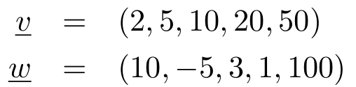
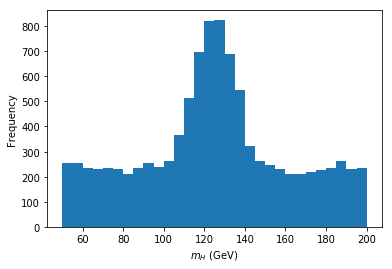

# Laboratorio di informatica - 6
### Prof. Stefano Carrazza

**Riassunto:** Esercizi di base in C++: arrays.

## Esercizio 1 - Hello World arrays

Scrivere un programma in C++ in cui vengono utilizzati arrays.

1. Costruire i seguenti vettori di tipo double usando stack arrays:

    

2. Stampare su terminale i valori di `v` e `w`, seguendo il formato:
    ```
      v[0] = <valore>
      v[1] = <valore>
      ...
      w[0] = <valore>
      w[1] = <valore>
      ...
    ```

3. Creare un array `double s[5]` e inizializzare `s` con i valori di `v`.

4. Sommare i valori di `w` in `s`.

5. Stampare `s` su schermo, seguendo il formato al punto 2.

## Esercizio 2 - Prodotto scalare

Scrivere un programma in C++ che calcola il prodotto scalare tra array dinamici.

1. Costruire i vettori `v` e `w` precedenti usando array dinamici. Ricordarsi di allocare array dinamici con l'operatore `new` e eliminarli alla fine del programma/scope con l'operatore `delete`.

2. Implementare il prodotto scalare tra `v` e `w` e stampare il risultato.

3. Creare un vettore `z` uguale a `v` (stessa dimensione e copia dei contenuti) con `z[2] = 0`.

4. Calcolare la normalizzazione di `z`.

5. Normalizzare `z` e stampare i suoi valori su terminale.

## Esercizio 3 - Prodotto matriciale
Scrivere un programma in C++ che calcola il prodotto tra matrici.

## Esercizio 4 - Moto rettilineo

Scrivere un programma in C++ che legga da file lo spazio e tempo di una particella carica in movimento rettilineo, calcola la velocità istantanea per ogni misura e determina la velocità media, la sua deviazione standard, il suo valore minimo e massimo.

1. Leggere da file i `N=1000` (numero noto di elementi) copie di punti **(x y)** con le variazioni di spazio (km) e tempo (h), calcolando per ogni elemento la velocità istantanea. Salvare tali valori in un array di tipo `double`.

2. Calcolare la velocità media, la rispettiva deviazione standard e stampare i risultati su schermo.

3. Calcolare la velocità minima e massima e stampare i risultati su schermo.

4. Verificare i risultati con il plot seguente:


## Esercizio 5 - Trovare la massa del bosone di Higgs

Scrivere un programma in C++ che legge da file le misure della distribuzione di massa invariante per il canale di produzione del bosone Higgs da 4 leptoni, effettuale da un acceleratore di particelle, e ne determina il valore più frequente per la sua massa.

La distribuzione in questione si presenta graficamente nel modo seguente:



1. Leggere tutti i `N = 10000` valori di massa invariante e salvare i dati in un array `mass`.

2. Ordinare il vettore `mass` in modo crescente usando selection sort. (Controllare l'algoritmo stampando su schermo tutti i valori)

3. Estrarre il valore minimo e massimo direttamente da `mass` (senza implementare cicli o algoritmi). Stampare i valori su terminale.

4. Costruire un array `bins` che contenga i bordi superiori (upper edge) di un istogramma a partire dal valore minimo della massa al valore massimo con steps da 5 GeV. Consiglio: determinare il numero di bins necessari e creare un array dinamico per il binning.

5. Creare un array `freq` per le frequenze dell'istogramma.

6. Istogrammare e stampare su schermo i valori dei bins e frequenze.

7. Determinare il bin (lower-edge) di massa del Higgs con la frequenza più elevata.
